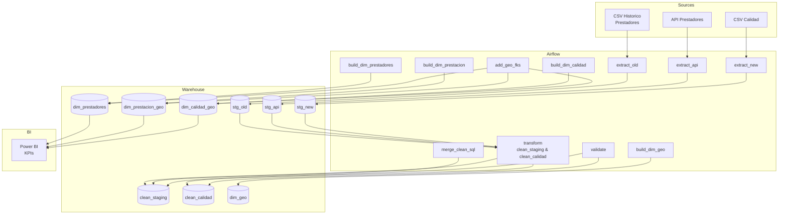
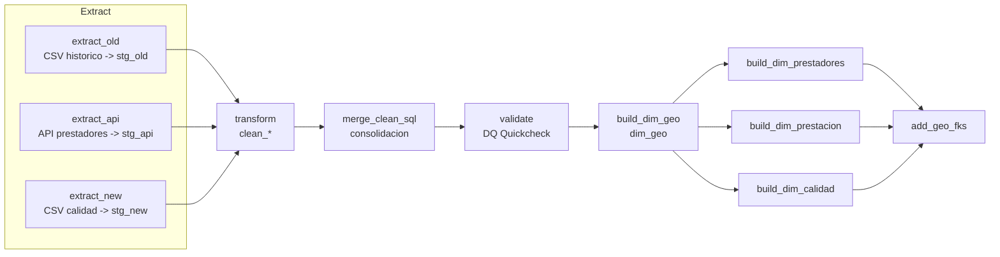
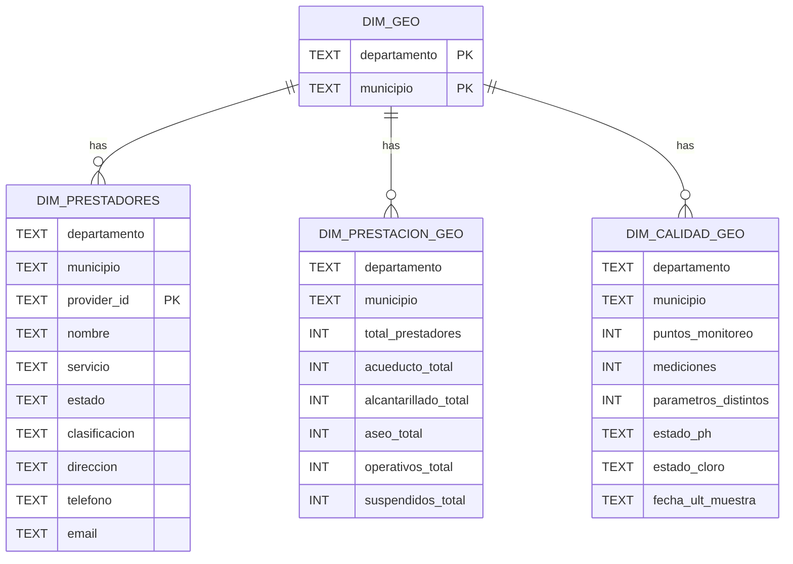

# 🚰 ETL PROYECTO 2 — Agua, Alcantarillado y Aseo (Colombia)

**Entrega 2 · Orquestación con Apache Airflow · Modelo Dimensional (Snowflake) · Validación de Datos**
**Stack:** Python · PostgreSQL · Docker/Compose · Apache Airflow · Power BI

**Equipo:**
Esteban Cobo · Jose David Mesa · Carlos Andrés Orozco · Sara Lucía Rojas · Breyner Posso

---

## 🌟 Objetivo

Construir un pipeline **ETL** reproducible y orquestado que:

* Integra **3 fuentes** (CSV histórico de prestadores, **API** de prestadores y **CSV** de calidad del agua).
* Normaliza, deduplica e **imputa** datos clave.
* Publica **dimensiones conformes** con llaves **Departamento–Municipio** (y `provider_id` en prestadores).
* Expone un **modelo Snowflake** apto para **KPIs** y tableros en **Power BI**.

---

## 🧰 Tecnologías

* 🐍 **Python** (transformaciones y utilidades)
* 🐘 **PostgreSQL** (staging, clean & warehouse)
* 🐳 **Docker Compose** (entorno reproducible)
* 🪶 **Apache Airflow** (DAGs y scheduling)
* 📊 **Power BI** (visualización de KPIs)

---

## 🧭 Arquitectura de Alto Nivel

---

## 🗂️ Datasets Incluidos

### 1) `stg_old` — CSV histórico de prestadores

* **Campos:** `nit`, `nombre`, `departamento_prestacion`, `municipio_prestacion`, `servicio`, `estado`, `clasificacion`, `direccion`, `telefono`, `email`.
* **Rol:** Base de prestadores + contacto/dirección (solo aquí existe contacto).

### 2) `stg_api` — API de prestadores

* **Campos:** `nombre`, `departamento_prestacion`, `municipio_prestacion`, `servicio`, `estado`, `clasificacion`.
* **Rol:** Complementa universo de prestadores/servicios. (Sin contacto).

### 3) `stg_new` — CSV de calidad del agua

* **Campos:** `departamento`, `municipio`, `fecha`, `propiedad_observada` (parámetro), `resultado`, `unidad_del_resultado`, `nombre_del_punto_de_monitoreo`, `latitud`, `longitud`.
* **Rol:** Series de calidad con coordenadas por **punto** y **fecha**.

---

## 🔁 DAG (Airflow)

**Orden de tareas:**
`extract_* → transform → merge_clean_sql → validate → build_dim_geo → build_dim_* → add_geo_fks`

---

## 🧪 Proceso ETL (detallado)

### 1) **Extract** (llevar fuentes a **staging** sin lógica de negocio)

* `extract_old`: CSV → `stg_old` (cast seguro a texto/número/fecha).
* `extract_api`: API → `stg_api` (esquema homogéneo con `stg_old`).
* `extract_new`: CSV → `stg_new` (sin limpiar semántica aún).

> **Buenas prácticas Airflow:** cada fuente en su Task, dependencias claras hacia `transform`.

---

### 2) **Transform** (construcción de **clean_***)

#### 2.1 Prestadores → `clean_staging`

* **Normalización:** `UPPER + TRIM + quitar tildes` en nombres y ubicaciones.
* **Llave técnica (`provider_id`)**: `COALESCE(nit, md5(UPPER(nombre)|dep|mun|servicio))`.
* **Servicio (catálogo):** `ACUEDUCTO / ALCANTARILLADO / ASEO`; si no mapea → `DESCONOCIDO` (para no perder filas).
* **Estado:** `OPERATIVA / SUSPENDIDA / OTRO`; **imputación por moda** `(servicio, departamento)` si falta.
* **Contacto** (`direccion/telefono/email`): se **preserva** desde `stg_old`.
* **Dominio geográfico:** `departamento` validado contra catálogo oficial del proyecto.
* **Deduplicación:** por `(provider_id, servicio, departamento, municipio)` (estrategia `ROW_NUMBER/ctid`).

**Salida:**
`clean_staging(provider_id, nombre, departamento, municipio, servicio, estado, clasificacion, direccion, telefono, email)`

#### 2.2 Calidad → `clean_calidad`

* **Fecha:** parse robusto a `DATE` (`fecha_muestra`).
* **Valor:** limpieza de símbolos + cast a `double precision`.
* **Coordenadas (COL):** lat∈`[-5, 15]`, lon∈`[-82, -66]`; si falta una → ambas `NULL`.
* **Plausibilidad:**

  * `pH` en `[0,14]` (fuera → `NULL` para imputar).
  * `Cloro` 0–5 mg/L (fuera → `NULL` para imputar).
* **Imputación:** `unidad` = **moda por parámetro**; `valor` = **mediana por (parámetro, departamento)** → fallback **mediana global**.
* **Unicidad:** `(departamento, municipio, parametro, fecha_muestra, COALESCE(nombre_punto,''))`.

**Salida:**
`clean_calidad(departamento, municipio, parametro, valor, fecha_muestra, unidad, nombre_punto, latitud, longitud)`

---

### 3) **Merge** (consolidación final de prestadores)

**¿Qué une y cómo?**

* **Fuentes:** `stg_old` + `stg_api` (ya normalizadas por `transform`).
* **Llave de dedupe:** `(provider_id, servicio, departamento, municipio)`.
* **Contacto:** se **toma desde `stg_old`** (si existe) para **direccion/telefono/email**.
* **Resultado:** `clean_staging` listo para dimensiones.

**Texto corto para diapositiva (merge):**

> *Se consolidaron prestadores de CSV y API usando `provider_id` (NIT o hash de nombre/dep/mun/servicio). Se normalizaron servicios, se deduplicó por `(provider_id, servicio, departamento, municipio)` y se preservó contacto desde histórico.*

---

### 4) **Dimensiones** (modelo **Snowflake**)

* `dim_geo(departamento, municipio)` **central**.
* `dim_prestadores(departamento, municipio, provider_id, …)`
* `dim_prestacion_geo(departamento, municipio, agregados)`
* `dim_calidad_geo(departamento, municipio, agregados calidad)`
* FKs `(NOT VALID + VALIDATE)` para no bloquear cargas y luego **validar**.

> Este **snowflake** permite compartir **geo** entre dominios y facilita agregar **hechos** en el futuro (drill-across).

---

## 🧪 Validación (DQ Quickcheck)

**Bloqueantes (falla el DAG):**

* Claves **no nulas** en `clean_staging` y `clean_calidad`.
* **Duplicados** en llaves lógicas.
* **Fechas fuera de rango** en `clean_calidad`.
* **Lat/Lon** fuera de Colombia o despareadas.
* **pH** y **Cloro** fuera de plausibilidad (deben estar `NULL` para imputación).

**Avisos (no bloquean):**

* `% DESCONOCIDO` en servicio/dep/mun mayor a umbral (p. ej. 5%).
* Regex de **e-mail**/**teléfono** dudosa.
* **Colisiones** municipio–día–parámetro (para revisión).

**Texto corto para diapositiva (validación):**

> *Se verifican completitud, unicidad, validez y plausibilidad. Reglas críticas detienen el DAG; avisos informan limpieza futura sin bloquear la carga.*

---

## 🧾 Tablas de Transformaciones (resumen)

### `clean_staging` (prestadores)

| Variable      | Origen         | Transformación principal                                 | Regla / Tipo                |     |         |                       |
| ------------- | -------------- | -------------------------------------------------------- | --------------------------- | --- | ------- | --------------------- |
| provider_id   | NIT / derivado | `COALESCE(nit, md5(UPPER(nombre)                         | dep                         | mun | serv))` | Llave técnica estable |
| nombre        | texto          | `UPPER + TRIM + quitar tildes`                           | Normalización               |     |         |                       |
| departamento  | texto          | Normalización + validación contra catálogo               | Dominio                     |     |         |                       |
| municipio     | texto          | `UPPER + TRIM + quitar tildes`                           | Normalización               |     |         |                       |
| servicio      | texto          | Mapeo a {ACUEDUCTO, ALCANTARILLADO, ASEO, DESCONOCIDO}   | Catálogo                    |     |         |                       |
| estado        | texto          | Agrupación + **imputación por moda** por (servicio, dep) | `OPERATIVA/SUSPENDIDA/OTRO` |     |         |                       |
| clasificacion | texto          | Normalización + **imputación por moda** por servicio     | Completar faltantes         |     |         |                       |
| direccion     | `stg_old`      | Copia directa si existe                                  | Preservación                |     |         |                       |
| telefono      | `stg_old`      | Copia + **aviso** si regex dudosa                        | Aviso (no bloquea)          |     |         |                       |
| email         | `stg_old`      | Copia + **aviso** si regex dudosa                        | Aviso (no bloquea)          |     |         |                       |
| Dedupe        | —              | `(provider_id, servicio, departamento, municipio)`       | `ROW_NUMBER/ctid`           |     |         |                       |

### `clean_calidad` (calidad del agua)

| Variable       | Transformación                                                | Regla / Tipo                                   |
| -------------- | ------------------------------------------------------------- | ---------------------------------------------- |
| fecha_muestra  | Parse robusto a `DATE`                                        | Rango `[2000-01-01, hoy]`                      |
| parametro      | `UPPER + TRIM + quitar tildes`                                | Normalización                                  |
| valor          | Limpieza → `double precision`                                 | `pH [0,14]`, `Cloro 0–5 mg/L` (fuera → `NULL`) |
| unidad         | `TRIM` + **moda por parámetro**                               | Imputación                                     |
| latitud/lon    | Cast + rángos COL; **pareo** (si falta una → ambas)           | Plausibilidad + consistencia                   |
| unicidad       | De-dup por `(dep, mun, parámetro, fecha, punto)`              | Evita registros repetidos                      |
| valor (impute) | **Mediana** por `(parámetro, departamento)` → fallback global | Robustez a outliers                            |

---

## 📈 KPIs & Visualizaciones (Power BI)

* **Prestación:**

  * # de prestadores por municipio y servicio.
  * % **Operativos** vs **Suspendidos**.
* **Calidad:**

  * Semáforos por municipio para **pH** y **Cloro**.
  * # de **puntos** y **mediciones**; **fecha** de última muestra.
* **Cobertura:**

  * Municipios **sin muestras** recientes.

> Conexión a **tablas de dimensiones**; claves geo compartidas aseguran comparabilidad.

---

## ▶️ Ejecución

1. Levanta el stack: `docker compose up -d`
2. Abre **Airflow** y lanza el DAG `etl`.
3. Revisa **logs** de `validate` para estado de calidad.
4. Conecta **Power BI** a `dim_prestadores`, `dim_prestacion_geo`, `dim_calidad_geo`.

---

## 🧩 Notas de Diseño

* Modelo **Snowflake** (no estrella):
  `dim_geo` central y **dimensiones colgantes** por `(departamento, municipio)`.
* Evitamos bloqueos en carga con FKs `NOT VALID` + comando posterior `VALIDATE CONSTRAINT`.
* La API no trae contacto; se preserva solo desde el histórico.

---

## 📌 Apéndice: Breve “slide text” listo para pegar

**Merge — en una frase:**

> Consolida `stg_old` y `stg_api` usando `provider_id` (NIT o hash de `nombre|dep|mun|servicio`), normaliza servicio, deduplica por `(provider_id, servicio, departamento, municipio)` y preserva contacto desde el histórico.

**Validación — en una frase:**

> Se verifican claves no nulas, duplicados y reglas de plausibilidad/fechas/coordenadas (bloqueantes), más avisos informativos (regex contacto, % DESCONOCIDO) sin detener el DAG.
